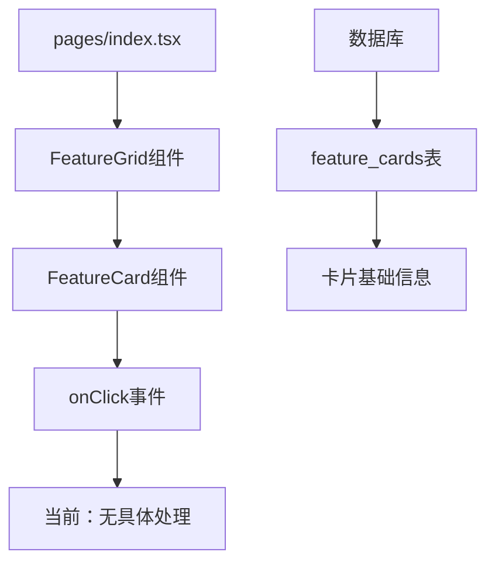
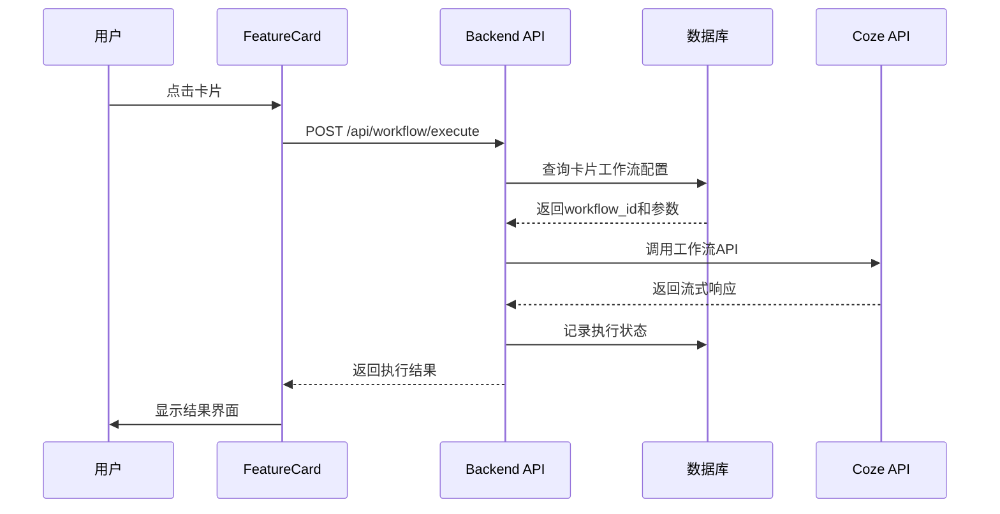

# 卡片Coze工作流集成技术方案

## 1. 项目概述

本文档设计了CATAIT智媒体运营工具中卡片点击后调用Coze工作流API的完整技术方案。通过使用原生fetch API调用Coze工作流接口，实现卡片与AI工作流的无缝连接，为用户提供智能化的功能体验。

## 2. 当前架构分析

### 2.1 现有组件结构



### 2.2 当前数据流

- **数据源**：MySQL数据库 `feature_cards` 表
- **API层**：`/api/cards` 接口提供CRUD操作
- **组件层**：FeatureGrid → FeatureCard → onClick事件
- **状态管理**：React useState管理卡片数据

### 2.3 现有卡片数据结构

```typescript
interface FeatureCardData {
  id: string;
  name: string;
  desc: string;
  icon: LucideIcon;
  bgColor: string;
  enabled: boolean;
  // 需要扩展的字段
  workflow_id?: string;
  workflow_parameters?: Record<string, any>;
}
```

## 3. Coze API集成设计

### 3.1 API调用配置

基于实际成功经验，我们使用原生fetch API而非SDK，避免兼容性问题并确保稳定性。

### 3.2 API客户端配置

```typescript
// src/lib/coze.ts

/**
 * 工作流执行接口
 */
export interface WorkflowExecutionParams {
  workflow_id: string;
  parameters: Record<string, any>;
  user_id?: string;
}

/**
 * 执行Coze工作流 - 使用原生fetch API
 */
export async function executeWorkflow(params: WorkflowExecutionParams) {
  try {
    const requestBody = {
      workflow_id: params.workflow_id,
      parameters: params.parameters
    };
    
    console.log('请求参数:', requestBody);
    
    const response = await fetch('https://api.coze.cn/v1/workflow/run', {
      method: 'POST',
      headers: {
        'Authorization': `Bearer ${process.env.NEXT_PUBLIC_COZE_API_TOKEN}`,
        'Content-Type': 'application/json'
      },
      body: JSON.stringify(requestBody)
    });
    
    console.log('响应状态:', response.status);
    
    const result = await response.json();
    console.log('API响应:', result);
    
    if (result.code === 0) {
      return {
        success: true,
        data: result.data
      };
    } else {
      return {
        success: false,
        error: result.msg || '工作流执行失败'
      };
    }
  } catch (error) {
    console.error('工作流执行失败:', error);
    return {
      success: false,
      error: error.message
    };
  }
}
```

### 3.3 环境变量配置

```env
# .env.local
NEXT_PUBLIC_COZE_API_TOKEN=sat_2Tbrpr7NNNHzijmBA0u2WFIwURfdnJX3XSYOUyH6tIErlnA7DNSP32Dp6k5tCidP
```

## 4. 卡片与工作流映射设计

### 4.1 数据库扩展

```sql
-- 扩展feature_cards表
ALTER TABLE feature_cards ADD COLUMN workflow_id VARCHAR(255);
ALTER TABLE feature_cards ADD COLUMN workflow_parameters JSON;
ALTER TABLE feature_cards ADD COLUMN workflow_enabled BOOLEAN DEFAULT TRUE;

-- 创建工作流执行记录表
CREATE TABLE workflow_executions (
  id INT AUTO_INCREMENT PRIMARY KEY,
  card_id VARCHAR(255) NOT NULL,
  workflow_id VARCHAR(255) NOT NULL,
  user_id VARCHAR(255),
  parameters JSON,
  status ENUM('pending', 'running', 'completed', 'failed') DEFAULT 'pending',
  result JSON,
  error_message TEXT,
  created_at TIMESTAMP DEFAULT CURRENT_TIMESTAMP,
  updated_at TIMESTAMP DEFAULT CURRENT_TIMESTAMP ON UPDATE CURRENT_TIMESTAMP,
  INDEX idx_card_id (card_id),
  INDEX idx_user_id (user_id),
  INDEX idx_status (status)
);
```

### 4.2 卡片配置示例

```json
{
  "id": "1",
  "name": "文案生成助手",
  "desc": "AI智能生成营销文案",
  "workflow_id": "7549852569017303049",
  "workflow_parameters": {
    "content_type": "marketing",
    "tone": "professional",
    "length": "medium"
  },
  "workflow_enabled": true
}
```

## 5. API调用流程设计

### 5.1 完整调用流程



### 5.2 后端API实现

```typescript
// pages/api/workflow/execute.ts
import { NextApiRequest, NextApiResponse } from 'next';
import { executeWorkflow } from '../../../src/lib/coze';
import { createConnection } from '../../../src/utils/db';

export default async function handler(
  req: NextApiRequest,
  res: NextApiResponse
) {
  if (req.method !== 'POST') {
    return res.status(405).json({ error: '方法不允许' });
  }

  try {
    const { cardId, userInputs = {} } = req.body;
    
    // 详细日志记录
    console.log('接收到工作流执行请求:', { cardId, userInputs });
    
    const connection = await createConnection();
    
    // 查询卡片工作流配置
    const [cards] = await connection.execute(
      'SELECT workflow_id, workflow_parameters FROM feature_cards WHERE id = ? AND workflow_enabled = 1',
      [cardId]
    );
    
    if (cards.length === 0) {
      return res.status(404).json({ error: '卡片未找到或工作流未启用' });
    }
    
    const card = cards[0];
    const workflowParams = {
      ...JSON.parse(card.workflow_parameters || '{}'),
      ...userInputs
    };
    
    // 记录执行开始
    const [result] = await connection.execute(
      'INSERT INTO workflow_executions (card_id, workflow_id, parameters, status) VALUES (?, ?, ?, ?)',
      [cardId, card.workflow_id, JSON.stringify(workflowParams), 'running']
    );
    
    const executionId = result.insertId;
    
    // 执行工作流
    const workflowResult = await executeWorkflow({
      workflow_id: card.workflow_id,
      parameters: workflowParams
    });
    
    // 详细日志记录
    console.log('工作流执行结果:', workflowResult);
    
    // 更新执行状态
    await connection.execute(
      'UPDATE workflow_executions SET status = ?, result = ?, error_message = ? WHERE id = ?',
      [
        workflowResult.success ? 'completed' : 'failed',
        JSON.stringify(workflowResult.data || {}),
        workflowResult.error || null,
        executionId
      ]
    );
    
    await connection.end();
    
    // 返回详细响应
    res.status(200).json({
      success: workflowResult.success,
      executionId,
      data: workflowResult.data,
      error: workflowResult.error,
      debug_info: {
        workflow_id: card.workflow_id,
        parameters: workflowParams
      }
    });
    
  } catch (error) {
    console.error('工作流执行API错误:', error);
    res.status(500).json({ error: '服务器内部错误' });
  }
}
```

### 5.3 前端调用实现

```typescript
// src/hooks/useWorkflow.ts
import { useState } from 'react';

export interface WorkflowExecution {
  cardId: string;
  userInputs?: Record<string, any>;
}

export function useWorkflow() {
  const [loading, setLoading] = useState(false);
  const [result, setResult] = useState(null);
  const [error, setError] = useState(null);
  
  const executeWorkflow = async (params: WorkflowExecution) => {
    setLoading(true);
    setError(null);
    
    try {
      const response = await fetch('/api/workflow/execute', {
        method: 'POST',
        headers: {
          'Content-Type': 'application/json',
          'Authorization': `Bearer ${localStorage.getItem('token')}`
        },
        body: JSON.stringify(params)
      });
      
      const data = await response.json();
      
      if (data.success) {
        setResult(data.data);
      } else {
        setError(data.error);
      }
      
      return data;
    } catch (err) {
      setError(err.message);
      return { success: false, error: err.message };
    } finally {
      setLoading(false);
    }
  };
  
  return {
    executeWorkflow,
    loading,
    result,
    error,
    clearResult: () => setResult(null),
    clearError: () => setError(null)
  };
}
```

## 6. 前端UI改进设计

### 6.1 卡片点击处理增强

```typescript
// src/components/FeatureCard/index.tsx (修改)
import React, { useState } from 'react';
import { useWorkflow } from '../../hooks/useWorkflow';
import WorkflowModal from '../WorkflowModal';

interface FeatureCardProps {
  id: string;
  name: string;
  desc: string;
  icon: LucideIcon;
  bgColor: string;
  workflowEnabled?: boolean;
  onClick?: () => void;
}

const FeatureCard: React.FC<FeatureCardProps> = ({
  id,
  name,
  desc,
  icon: IconComponent,
  bgColor,
  workflowEnabled = false,
  onClick
}) => {
  const [showModal, setShowModal] = useState(false);
  const { executeWorkflow, loading, result, error } = useWorkflow();
  
  const handleCardClick = () => {
    if (workflowEnabled) {
      setShowModal(true);
    } else if (onClick) {
      onClick();
    }
  };
  
  const handleWorkflowExecute = async (userInputs: Record<string, any>) => {
    const result = await executeWorkflow({
      cardId: id,
      userInputs
    });
    
    if (result.success) {
      // 显示结果
      setShowModal(false);
    }
  };
  
  return (
    <>
      <div 
        className={`bg-white rounded-xl p-4 cursor-pointer transform transition-all duration-300 hover:scale-105 hover:-translate-y-1 ${
          loading ? 'opacity-50 pointer-events-none' : ''
        }`}
        onClick={handleCardClick}
      >
        {/* 原有卡片内容 */}
        <div className="flex items-center justify-between">
          <div className="flex-1">
            <h3 className="text-gray-900 font-medium text-sm mb-1">{name}</h3>
            <p className="text-gray-500 text-xs">{desc}</p>
          </div>
          <div className={`w-12 h-12 rounded-full flex items-center justify-center ml-3 relative ${bgColor}`}>
            {loading ? (
              <div className="animate-spin rounded-full h-6 w-6 border-b-2 border-white"></div>
            ) : (
              <IconComponent className="w-6 h-6 text-white" />
            )}
          </div>
        </div>
        
        {/* 工作流状态指示器 */}
        {workflowEnabled && (
          <div className="mt-2 flex items-center justify-between">
            <span className="text-xs text-blue-600 bg-blue-50 px-2 py-1 rounded-full">
              AI工作流
            </span>
          </div>
        )}
      </div>
      
      {/* 工作流执行模态框 */}
      {showModal && (
        <WorkflowModal
          cardName={name}
          onExecute={handleWorkflowExecute}
          onClose={() => setShowModal(false)}
          loading={loading}
          result={result}
          error={error}
        />
      )}
    </>
  );
};
```

### 6.2 工作流执行模态框

```typescript
// src/components/WorkflowModal/index.tsx
import React, { useState } from 'react';
import { X, Play, CheckCircle, AlertCircle } from 'lucide-react';

interface WorkflowModalProps {
  cardName: string;
  onExecute: (inputs: Record<string, any>) => void;
  onClose: () => void;
  loading: boolean;
  result?: any;
  error?: string;
}

const WorkflowModal: React.FC<WorkflowModalProps> = ({
  cardName,
  onExecute,
  onClose,
  loading,
  result,
  error
}) => {
  const [inputs, setInputs] = useState<Record<string, any>>({});
  
  const handleSubmit = (e: React.FormEvent) => {
    e.preventDefault();
    onExecute(inputs);
  };
  
  return (
    <div className="fixed inset-0 bg-black bg-opacity-50 flex items-center justify-center z-50 p-4">
      <div className="bg-white rounded-lg max-w-md w-full max-h-[80vh] overflow-y-auto">
        {/* 头部 */}
        <div className="flex items-center justify-between p-4 border-b">
          <h3 className="text-lg font-semibold">{cardName}</h3>
          <button onClick={onClose} className="p-1 hover:bg-gray-100 rounded">
            <X className="w-5 h-5" />
          </button>
        </div>
        
        {/* 内容 */}
        <div className="p-4">
          {!result && !error && (
            <form onSubmit={handleSubmit} className="space-y-4">
              <div>
                <label className="block text-sm font-medium text-gray-700 mb-2">
                  输入内容
                </label>
                <textarea
                  className="w-full p-3 border border-gray-300 rounded-lg focus:ring-2 focus:ring-blue-500 focus:border-transparent"
                  rows={4}
                  placeholder="请输入您的需求..."
                  value={inputs.content || ''}
                  onChange={(e) => setInputs(prev => ({ ...prev, content: e.target.value }))}
                />
              </div>
              
              <button
                type="submit"
                disabled={loading}
                className="w-full bg-blue-600 text-white py-2 px-4 rounded-lg hover:bg-blue-700 disabled:opacity-50 flex items-center justify-center gap-2"
              >
                {loading ? (
                  <>
                    <div className="animate-spin rounded-full h-4 w-4 border-b-2 border-white"></div>
                    执行中...
                  </>
                ) : (
                  <>
                    <Play className="w-4 h-4" />
                    执行工作流
                  </>
                )}
              </button>
            </form>
          )}
          
          {/* 成功结果 */}
          {result && (
            <div className="space-y-4">
              <div className="flex items-center gap-2 text-green-600">
                <CheckCircle className="w-5 h-5" />
                <span className="font-medium">执行成功</span>
              </div>
              <div className="bg-gray-50 p-3 rounded-lg">
                <pre className="text-sm whitespace-pre-wrap">{JSON.stringify(result, null, 2)}</pre>
              </div>
            </div>
          )}
          
          {/* 错误信息 */}
          {error && (
            <div className="space-y-4">
              <div className="flex items-center gap-2 text-red-600">
                <AlertCircle className="w-5 h-5" />
                <span className="font-medium">执行失败</span>
              </div>
              <div className="bg-red-50 p-3 rounded-lg text-red-700">
                {error}
              </div>
            </div>
          )}
        </div>
      </div>
    </div>
  );
};

export default WorkflowModal;
```

## 7. 后台管理扩展

### 7.1 卡片工作流配置

在后台管理页面添加工作流配置功能：

```typescript
// 在admin.tsx中添加工作流配置字段
const [editingCard, setEditingCard] = useState({
  // 现有字段...
  workflow_id: '',
  workflow_parameters: '{}',
  workflow_enabled: false
});

// 工作流配置表单
<div className="space-y-4">
  <div>
    <label className="block text-sm font-medium text-gray-700 mb-1">
      工作流ID
    </label>
    <input
      type="text"
      value={editingCard.workflow_id}
      onChange={(e) => setEditingCard(prev => ({ ...prev, workflow_id: e.target.value }))}
      className="w-full p-2 border border-gray-300 rounded-lg"
      placeholder="输入Coze工作流ID"
    />
  </div>
  
  <div>
    <label className="block text-sm font-medium text-gray-700 mb-1">
      工作流参数 (JSON)
    </label>
    <textarea
      value={editingCard.workflow_parameters}
      onChange={(e) => setEditingCard(prev => ({ ...prev, workflow_parameters: e.target.value }))}
      className="w-full p-2 border border-gray-300 rounded-lg"
      rows={3}
      placeholder='{"key": "value"}'
    />
  </div>
  
  <div className="flex items-center">
    <input
      type="checkbox"
      checked={editingCard.workflow_enabled}
      onChange={(e) => setEditingCard(prev => ({ ...prev, workflow_enabled: e.target.checked }))}
      className="mr-2"
    />
    <label className="text-sm text-gray-700">启用工作流</label>
  </div>
</div>
```

## 8. 安全考虑

### 8.1 Token管理

```typescript
// src/lib/security.ts
/**
 * 安全的token管理
 */
export class TokenManager {
  private static readonly TOKEN_KEY = 'coze_api_token';
  
  static setToken(token: string): void {
    // 仅在服务端存储敏感token
    if (typeof window === 'undefined') {
      process.env.COZE_API_TOKEN = token;
    }
  }
  
  static getToken(): string | null {
    return process.env.COZE_API_TOKEN || null;
  }
  
  static validateToken(token: string): boolean {
    return token && token.startsWith('sat_') && token.length > 20;
  }
}
```

### 8.2 权限控制

```typescript
// 在API中添加权限检查
export default async function handler(req: NextApiRequest, res: NextApiResponse) {
  // 验证用户身份
  const token = req.headers.authorization?.replace('Bearer ', '');
  if (!token) {
    return res.status(401).json({ error: '未授权访问' });
  }
  
  // 验证用户权限
  const user = await verifyUserToken(token);
  if (!user) {
    return res.status(401).json({ error: '无效token' });
  }
  
  // 检查工作流执行权限
  if (!user.permissions.includes('workflow_execute')) {
    return res.status(403).json({ error: '无工作流执行权限' });
  }
  
  // 继续处理请求...
}
```

## 9. 错误处理和用户体验

### 9.1 错误分类处理

```typescript
// src/utils/errorHandler.ts
export enum WorkflowErrorType {
  NETWORK_ERROR = 'network_error',
  AUTH_ERROR = 'auth_error',
  WORKFLOW_NOT_FOUND = 'workflow_not_found',
  PARAMETER_ERROR = 'parameter_error',
  QUOTA_EXCEEDED = 'quota_exceeded',
  UNKNOWN_ERROR = 'unknown_error'
}

export function handleWorkflowError(error: any): {
  type: WorkflowErrorType;
  message: string;
  userMessage: string;
} {
  if (error.code === 'NETWORK_ERROR') {
    return {
      type: WorkflowErrorType.NETWORK_ERROR,
      message: error.message,
      userMessage: '网络连接失败，请检查网络后重试'
    };
  }
  
  if (error.status === 401) {
    return {
      type: WorkflowErrorType.AUTH_ERROR,
      message: 'Authentication failed',
      userMessage: '身份验证失败，请重新登录'
    };
  }
  
  if (error.status === 404) {
    return {
      type: WorkflowErrorType.WORKFLOW_NOT_FOUND,
      message: 'Workflow not found',
      userMessage: '工作流不存在，请联系管理员'
    };
  }
  
  return {
    type: WorkflowErrorType.UNKNOWN_ERROR,
    message: error.message || 'Unknown error',
    userMessage: '执行失败，请稍后重试'
  };
}
```

### 9.2 用户体验优化

```typescript
// 添加重试机制
export async function executeWorkflowWithRetry(
  params: WorkflowExecutionParams,
  maxRetries: number = 3
) {
  let lastError;
  
  for (let i = 0; i < maxRetries; i++) {
    try {
      return await executeWorkflow(params);
    } catch (error) {
      lastError = error;
      
      // 如果是网络错误，等待后重试
      if (error.code === 'NETWORK_ERROR' && i < maxRetries - 1) {
        await new Promise(resolve => setTimeout(resolve, 1000 * (i + 1)));
        continue;
      }
      
      // 其他错误直接抛出
      throw error;
    }
  }
  
  throw lastError;
}
```

## 10. 部署和监控

### 10.1 环境配置

```yaml
# docker-compose.yml
version: '3.8'
services:
  app:
    build: .
    environment:
      - COZE_API_TOKEN=${COZE_API_TOKEN}
      - COZE_BASE_URL=https://api.coze.cn
      - DATABASE_URL=${DATABASE_URL}
    ports:
      - "3000:3000"
```

### 10.2 监控指标

```typescript
// src/utils/metrics.ts
export class WorkflowMetrics {
  static async recordExecution(cardId: string, success: boolean, duration: number) {
    // 记录执行指标
    await fetch('/api/metrics/workflow', {
      method: 'POST',
      headers: { 'Content-Type': 'application/json' },
      body: JSON.stringify({
        cardId,
        success,
        duration,
        timestamp: Date.now()
      })
    });
  }
  
  static async getExecutionStats(cardId?: string) {
    const response = await fetch(`/api/metrics/workflow/stats${cardId ? `?cardId=${cardId}` : ''}`);
    return response.json();
  }
}
```

## 11. 实施计划

### 阶段一：基础集成（1-2周）
1. 安装Coze SDK
2. 创建基础API接口
3. 扩展数据库表结构
4. 实现简单的工作流调用

### 阶段二：UI增强（1周）
1. 修改FeatureCard组件
2. 创建WorkflowModal组件
3. 添加加载状态和错误处理
4. 实现结果展示

### 阶段三：管理功能（1周）
1. 扩展后台管理界面
2. 添加工作流配置功能
3. 实现执行记录查看
4. 添加监控面板

### 阶段四：优化完善（1周）
1. 性能优化
2. 安全加固
3. 错误处理完善
4. 用户体验优化

## 12. 实际成功经验总结

### 12.1 关键成功因素

基于实际项目实施经验，以下是确保工作流集成成功的关键要点：

#### API调用最佳实践
- **使用原生fetch API**：避免SDK兼容性问题，确保稳定性
- **正确的API端点**：使用 `https://api.coze.cn/v1/workflow/run` 而非流式端点
- **标准JSON格式**：确保请求体格式正确，避免参数结构问题
- **详细日志记录**：记录完整的请求和响应信息，便于调试

#### 参数配置要点
- **环境变量配置**：使用 `NEXT_PUBLIC_COZE_API_TOKEN` 确保前端可访问
- **参数结构验证**：确保 `workflow_id` 和 `parameters` 格式正确
- **输入数据处理**：正确处理URL等输入参数，避免格式错误

#### 错误处理机制
- **HTTP状态码检查**：验证响应状态码
- **API响应码验证**：检查 `result.code === 0` 确认成功
- **详细错误信息**：提供具体的错误描述和调试信息
- **debug_url支持**：利用Coze提供的调试链接进行问题排查

### 12.2 常见问题及解决方案

1. **HTTP 400错误**：通常由参数格式问题引起，检查JSON结构和字段名称
2. **工作流节点执行失败**：验证工作流ID和输入参数是否匹配工作流配置
3. **Token认证失败**：确保环境变量正确配置且Token有效
4. **网络连接问题**：添加重试机制和超时处理

## 13. 总结

本方案提供了完整的卡片Coze工作流集成解决方案，包括：

- **技术架构**：基于原生fetch API的稳定集成
- **数据设计**：扩展现有数据库支持工作流配置
- **用户体验**：流畅的交互流程和清晰的状态反馈
- **安全性**：完善的权限控制和token管理
- **可维护性**：模块化设计和完整的错误处理
- **可扩展性**：支持多种工作流类型和参数配置
- **实战验证**：基于实际成功经验的最佳实践

通过此方案，用户可以通过简单的卡片点击操作，无缝调用强大的AI工作流功能，大大提升产品的智能化水平和用户体验。