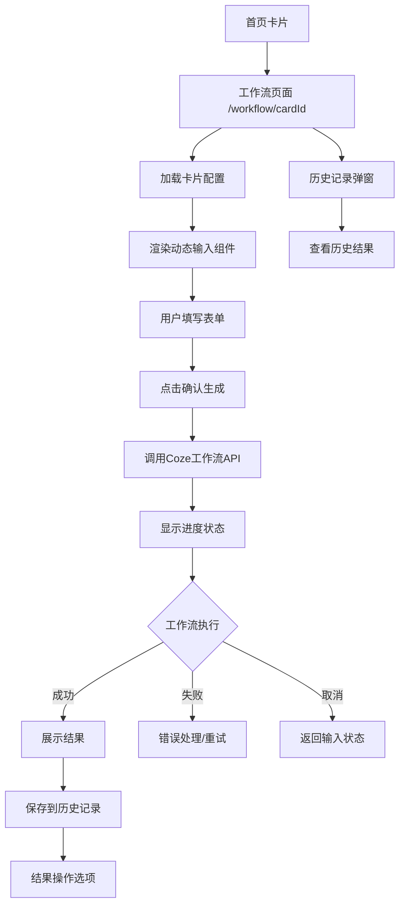
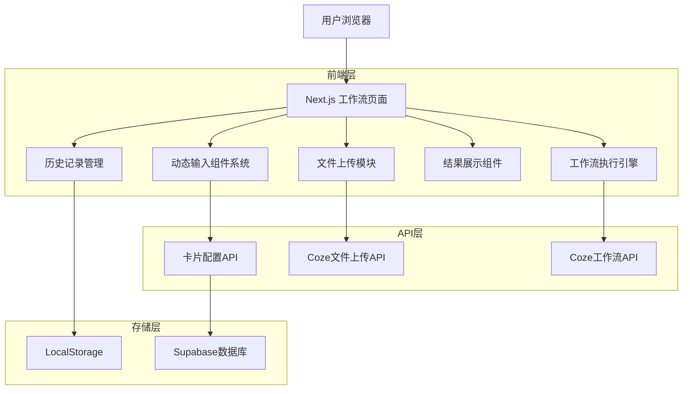
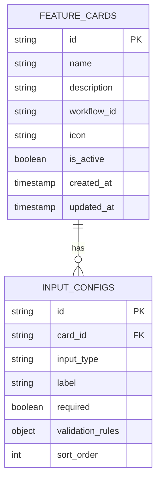

# 工作流页面技术实现文档

## 1. 项目概述

本文档详细描述了工作流页面的技术实现方案，该页面允许用户通过动态配置的输入组件与Coze工作流进行交互，支持多种输入类型、文件上传、结果展示和历史记录功能。

## 2. 核心功能

### 2.1 用户角色

| 角色 | 权限 | 功能描述 |
|------|------|----------|
| 普通用户 | 基础使用权限 | 可访问工作流页面，使用配置好的输入组件，查看生成结果和历史记录 |
| 管理员 | 完整管理权限 | 可在后台管理中配置卡片的输入类型，管理工作流参数 |

### 2.2 功能模块

工作流页面包含以下核心模块：

1. **动态路由页面**：/workflow/[cardId] 路由实现，根据卡片ID加载对应配置
2. **输入配置系统**：支持后台管理配置多种输入类型的动态表单
3. **文件上传模块**：集成Coze文件上传API，支持图片、视频等文件类型
4. **工作流执行**：调用Coze工作流API，支持进度显示和任务取消
5. **结果展示区**：支持四种结果类型的统一展示界面
6. **历史记录**：本地存储的历史记录查看功能

### 2.3 页面详情

| 页面名称 | 模块名称 | 功能描述 |
|----------|----------|----------|
| 工作流页面 | 页面头部 | 显示卡片名称、返回按钮、历史记录入口 |
| 工作流页面 | 动态输入区 | 根据卡片配置动态渲染文本框、文件上传、选择器等输入组件 |
| 工作流页面 | 操作按钮区 | 确认生成按钮、取消按钮、清空输入按钮 |
| 工作流页面 | 进度显示区 | 加载动画、进度条、状态提示信息 |
| 工作流页面 | 结果展示区 | 支持文本、图片、视频、链接四种结果类型的展示 |
| 工作流页面 | 结果操作区 | 保存结果、复制链接、分享功能 |
| 历史记录弹窗 | 记录列表 | 显示历史生成记录，支持查看详情和重新使用 |

## 3. 核心流程

### 3.1 用户操作流程

1. 用户从首页点击功能卡片
2. 跳转到 /workflow/[cardId] 页面
3. 系统根据卡片ID加载输入配置
4. 用户填写动态生成的输入表单
5. 点击确认生成按钮启动工作流
6. 显示进度动画，支持取消操作
7. 工作流完成后展示结果
8. 用户可保存结果或复制链接
9. 结果自动保存到本地历史记录

### 3.2 页面导航流程图



## 4. 用户界面设计

### 4.1 设计风格

- **主色调**：蓝色系 (#3B82F6) 和绿色系 (#10B981)
- **辅助色**：灰色系 (#6B7280) 和白色 (#FFFFFF)
- **按钮样式**：圆角设计，支持悬停效果和加载状态
- **字体**：系统默认字体，标题16px，正文14px，说明文字12px
- **布局风格**：卡片式布局，响应式设计
- **图标风格**：线性图标，统一使用Heroicons图标库

### 4.2 页面设计概览

| 页面名称 | 模块名称 | UI元素 |
|----------|----------|--------|
| 工作流页面 | 页面头部 | 深色背景，白色文字，返回箭头图标，历史记录图标 |
| 工作流页面 | 动态输入区 | 白色卡片背景，边框阴影，标签和输入框垂直排列 |
| 工作流页面 | 文件上传组件 | 虚线边框拖拽区域，上传图标，进度条显示 |
| 工作流页面 | 确认按钮 | 蓝色背景，白色文字，加载状态显示旋转图标 |
| 工作流页面 | 进度显示 | 居中布局，圆形进度条，状态文字提示 |
| 工作流页面 | 结果展示 | 白色卡片，根据结果类型动态调整布局和样式 |
| 历史记录弹窗 | 记录列表 | 时间轴样式，每条记录显示时间、输入摘要、结果预览 |

### 4.3 响应式设计

- **桌面端优先**：主要针对桌面端设计，最小宽度1024px
- **移动端适配**：支持768px以下屏幕，采用单列布局
- **触摸优化**：按钮和交互元素最小44px触摸区域

## 5. 技术架构

### 5.1 架构设计



### 5.2 技术栈

- **前端**：Next.js 14 + React 18 + TypeScript + Tailwind CSS
- **状态管理**：React Hooks + Context API
- **API调用**：原生Fetch API（避免SDK兼容性问题）
- **文件上传**：React Dropzone + Coze Upload API
- **本地存储**：LocalStorage API
- **HTTP客户端**：原生Fetch API + 详细日志记录

### 5.3 路由定义

| 路由 | 用途 |
|------|------|
| /workflow/[cardId] | 工作流页面，根据卡片ID动态加载配置和渲染界面 |

### 5.4 API定义

#### 4.1 卡片配置API

获取卡片输入配置
```
GET /api/cards/[cardId]/config
```

响应：
| 参数名 | 参数类型 | 描述 |
|--------|----------|------|
| id | string | 卡片ID |
| name | string | 卡片名称 |
| description | string | 卡片描述 |
| inputTypes | InputType[] | 输入类型配置数组 |
| workflowId | string | Coze工作流ID |

#### 4.2 工作流执行API

启动工作流
```
POST /api/workflow/execute
```

请求：
| 参数名 | 参数类型 | 是否必需 | 描述 |
|--------|----------|----------|------|
| cardId | string | true | 卡片ID |
| inputs | object | true | 输入数据对象 |
| files | File[] | false | 上传的文件数组 |

响应：
| 参数名 | 参数类型 | 描述 |
|--------|----------|------|
| success | boolean | 执行是否成功 |
| executionId | string | 执行记录ID |
| data | object | 执行结果数据 |
| error | string | 错误信息（如果失败） |
| debug_info | object | 调试信息（包含workflow_id和参数） |

#### 4.3 Coze工作流API

直接调用Coze工作流API
```
POST https://api.coze.cn/v1/workflow/run
```

请求头：
```
Authorization: Bearer ${NEXT_PUBLIC_COZE_API_TOKEN}
Content-Type: application/json
```

请求体：
```json
{
  "workflow_id": "7549776785002283060",
  "parameters": {
    "input": "https://v.douyin.com/ipT9jS1Z7nc/"
  }
}
```

#### 4.4 文件上传API

调用Coze文件上传API <mcreference link="https://www.coze.cn/open/docs/developer_guides/upload_files" index="0">0</mcreference>
```
POST https://api.coze.cn/v1/files/upload
```

## 6. 数据模型

### 6.1 数据模型定义



### 6.2 数据定义语言

输入配置表 (input_configs)
```sql
-- 创建输入配置表
CREATE TABLE input_configs (
    id UUID PRIMARY KEY DEFAULT gen_random_uuid(),
    card_id UUID NOT NULL REFERENCES feature_cards(id) ON DELETE CASCADE,
    input_type VARCHAR(50) NOT NULL CHECK (input_type IN ('text', 'textarea', 'file', 'image', 'video', 'url', 'select', 'multiselect')),
    label VARCHAR(100) NOT NULL,
    placeholder VARCHAR(200),
    required BOOLEAN DEFAULT false,
    validation_rules JSONB DEFAULT '{}',
    options JSONB DEFAULT '[]', -- 用于select类型的选项
    sort_order INTEGER DEFAULT 0,
    created_at TIMESTAMP WITH TIME ZONE DEFAULT NOW(),
    updated_at TIMESTAMP WITH TIME ZONE DEFAULT NOW()
);

-- 创建索引
CREATE INDEX idx_input_configs_card_id ON input_configs(card_id);
CREATE INDEX idx_input_configs_sort_order ON input_configs(card_id, sort_order);

-- 为现有卡片添加默认文本输入配置
INSERT INTO input_configs (card_id, input_type, label, placeholder, required, sort_order)
SELECT 
    id,
    'text',
    '输入内容',
    '请输入您的需求...',
    true,
    1
FROM feature_cards;

-- 设置权限
GRANT SELECT ON input_configs TO anon;
GRANT ALL PRIVILEGES ON input_configs TO authenticated;
```

## 7. 组件设计

### 7.1 核心组件结构

```typescript
// 工作流页面主组件
interface WorkflowPageProps {
  cardId: string;
}

// 动态输入组件
interface DynamicInputProps {
  config: InputConfig;
  value: any;
  onChange: (value: any) => void;
  error?: string;
}

// 文件上传组件
interface FileUploadProps {
  accept: string;
  multiple: boolean;
  onUpload: (files: File[]) => Promise<string[]>;
  maxSize: number;
}

// 结果展示组件
interface ResultDisplayProps {
  result: WorkflowResult;
  onSave: () => void;
  onCopy: () => void;
}

// 历史记录组件
interface HistoryModalProps {
  isOpen: boolean;
  onClose: () => void;
  onSelectHistory: (record: HistoryRecord) => void;
}
```

### 7.2 状态管理

```typescript
// 工作流页面状态
interface WorkflowState {
  cardConfig: CardConfig | null;
  inputValues: Record<string, any>;
  isLoading: boolean;
  isExecuting: boolean;
  progress: number;
  result: WorkflowResult | null;
  error: string | null;
  history: HistoryRecord[];
}

// 输入配置类型
interface InputConfig {
  id: string;
  type: 'text' | 'textarea' | 'file' | 'image' | 'video' | 'url' | 'select' | 'multiselect';
  label: string;
  placeholder?: string;
  required: boolean;
  validationRules: Record<string, any>;
  options?: string[]; // 用于select类型
}

// 历史记录类型
interface HistoryRecord {
  id: string;
  cardId: string;
  cardName: string;
  inputs: Record<string, any>;
  result: WorkflowResult;
  timestamp: number;
}
```

## 8. 实施计划

### 8.1 第一阶段：基础架构（1-2天）
- 创建动态路由页面 /workflow/[cardId]
- 实现卡片配置数据获取
- 设计基础页面布局和样式

### 8.2 第二阶段：输入系统（2-3天）
- 开发动态输入组件系统
- 实现各种输入类型组件
- 集成表单验证和错误处理

### 8.3 第三阶段：文件上传（1-2天）
- 集成Coze文件上传API <mcreference link="https://www.coze.cn/open/docs/developer_guides/upload_files" index="0">0</mcreference>
- 实现拖拽上传功能
- 添加上传进度显示

### 8.4 第四阶段：工作流执行（2-3天）
- 实现工作流API调用
- 添加进度显示和取消功能
- 集成失败重试机制 <mcreference link="https://www.coze.cn/open/docs/developer_guides/workflow_resume" index="1">1</mcreference>

### 8.5 第五阶段：结果展示（1-2天）
- 开发多类型结果展示组件
- 实现保存和复制功能
- 添加结果操作选项

### 8.6 第六阶段：历史记录（1天）
- 实现本地存储历史记录
- 开发历史记录查看界面
- 添加历史记录重用功能

### 8.7 第七阶段：优化测试（1-2天）
- 响应式设计优化
- 性能优化和错误处理
- 全面功能测试

## 9. 技术特色

- **原生API调用**：使用原生fetch API而非SDK，避免兼容性问题，确保稳定性
- **详细日志记录**：完整的请求和响应日志，便于问题诊断和调试
- **正确端点使用**：使用验证过的 `/v1/workflow/run` 端点，而非流式端点
- **参数格式优化**：确保JSON格式正确，避免参数结构问题
- **动态配置**：支持后台管理灵活配置输入类型，无需修改代码
- **类型安全**：使用TypeScript确保类型安全和开发效率
- **响应式设计**：适配多种设备屏幕尺寸
- **本地存储**：历史记录存储在本地，保护用户隐私
- **错误恢复**：支持工作流执行失败后的恢复机制
- **文件上传**：集成Coze官方文件上传API，支持多种文件类型
- **实时反馈**：提供详细的进度显示和状态反馈
- **调试友好**：包含debug_url和详细错误信息，便于问题排查