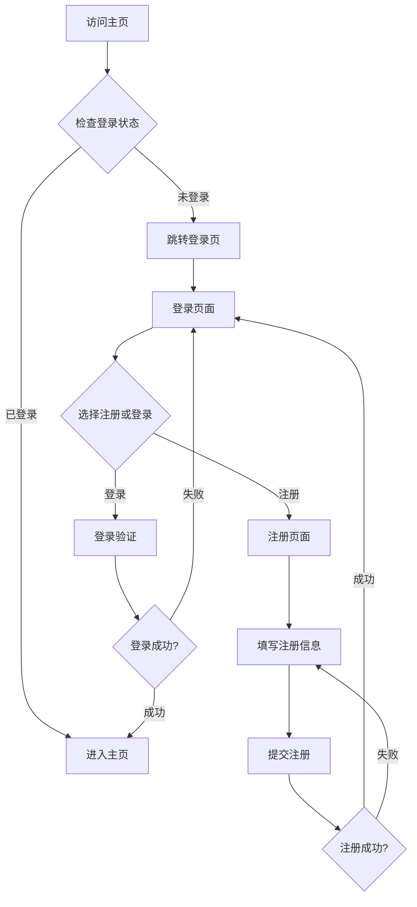

# Ai企业获客盈利系统 - 用户注册登录系统产品需求文档

## 1. 产品概述

Ai企业获客盈利系统用户注册登录系统，为用户提供安全便捷的账户管理功能。用户必须完成注册登录后才能访问主页功能，确保系统安全性和用户数据保护。

系统支持多种登录方式（用户名/邮箱/手机号），提供完整的用户生命周期管理，与现有项目设计风格保持一致。

## 2. 核心功能

### 2.1 用户角色

| 角色 | 注册方式 | 核心权限 |
|------|----------|----------|
| 普通用户 | 邮箱/手机号注册 | 可访问主页功能，使用所有工具 |
| 邀请用户 | 邀请码注册 | 可访问主页功能，使用所有工具 |

### 2.2 功能模块

我们的用户注册登录系统包含以下主要页面：
1. **注册页面**：用户信息填写、邀请码验证、密码设置
2. **登录页面**：多种登录方式、密码验证、记住登录状态
3. **权限验证**：路由守卫、登录状态检查、自动跳转

### 2.3 页面详情

| 页面名称 | 模块名称 | 功能描述 |
|----------|----------|----------|
| 注册页面 | 用户信息表单 | 收集用户名、手机号、邮箱、邀请码、密码信息，进行格式验证和唯一性检查 |
| 注册页面 | 邀请码验证 | 验证邀请码有效性，支持可选填写 |
| 注册页面 | 密码安全 | 密码强度检查，确认密码一致性验证 |
| 登录页面 | 登录表单 | 支持用户名/邮箱/手机号+密码登录，自动识别登录方式 |
| 登录页面 | 登录状态 | 记住登录状态，自动登录功能 |
| 登录页面 | 错误处理 | 登录失败提示，账户锁定保护 |
| 权限验证 | 路由守卫 | 检查用户登录状态，未登录自动跳转到登录页 |
| 权限验证 | 会话管理 | JWT token管理，自动刷新和过期处理 |

## 3. 核心流程

### 用户注册流程
1. 用户访问注册页面
2. 填写用户名、手机号、邮箱、密码（邀请码可选）
3. 系统验证信息格式和唯一性
4. 密码加密存储到数据库
5. 注册成功，自动跳转到登录页面

### 用户登录流程
1. 用户访问登录页面
2. 输入用户名/邮箱/手机号和密码
3. 系统验证用户凭据
4. 生成JWT token并返回
5. 前端存储token，跳转到主页

### 权限验证流程
1. 用户访问需要登录的页面
2. 路由守卫检查token有效性
3. 如果未登录或token过期，跳转到登录页
4. 登录成功后，跳转到原目标页面

## 4. 用户界面设计

### 4.1 设计风格

- **主色调**：与项目现有主题色保持一致（蓝色渐变 #3B82F6 到 #1E40AF）
- **卡片样式**：立体效果，使用阴影和圆角设计
- **按钮风格**：渐变背景，圆角设计，悬停动画效果
- **字体**：系统默认字体，标题16px，正文14px
- **布局风格**：居中卡片布局，响应式设计
- **图标风格**：使用Lucide React图标库，简洁现代

### 4.2 页面设计概览

| 页面名称 | 模块名称 | UI元素 |
|----------|----------|--------|
| 注册页面 | 主容器 | 居中白色卡片，立体阴影效果，圆角12px，最大宽度400px |
| 注册页面 | 表单区域 | 输入框带图标，蓝色边框聚焦效果，错误状态红色提示 |
| 注册页面 | 提交按钮 | 蓝色渐变背景，白色文字，圆角8px，悬停加深效果 |
| 登录页面 | 主容器 | 与注册页面相同的卡片设计风格 |
| 登录页面 | 登录方式 | 智能识别输入类型，单一输入框设计 |
| 登录页面 | 记住登录 | 复选框组件，蓝色主题色 |

### 4.3 响应式设计

系统采用移动优先的响应式设计，在桌面端和移动端都能提供良好的用户体验。卡片布局在小屏幕上自动调整宽度和间距。