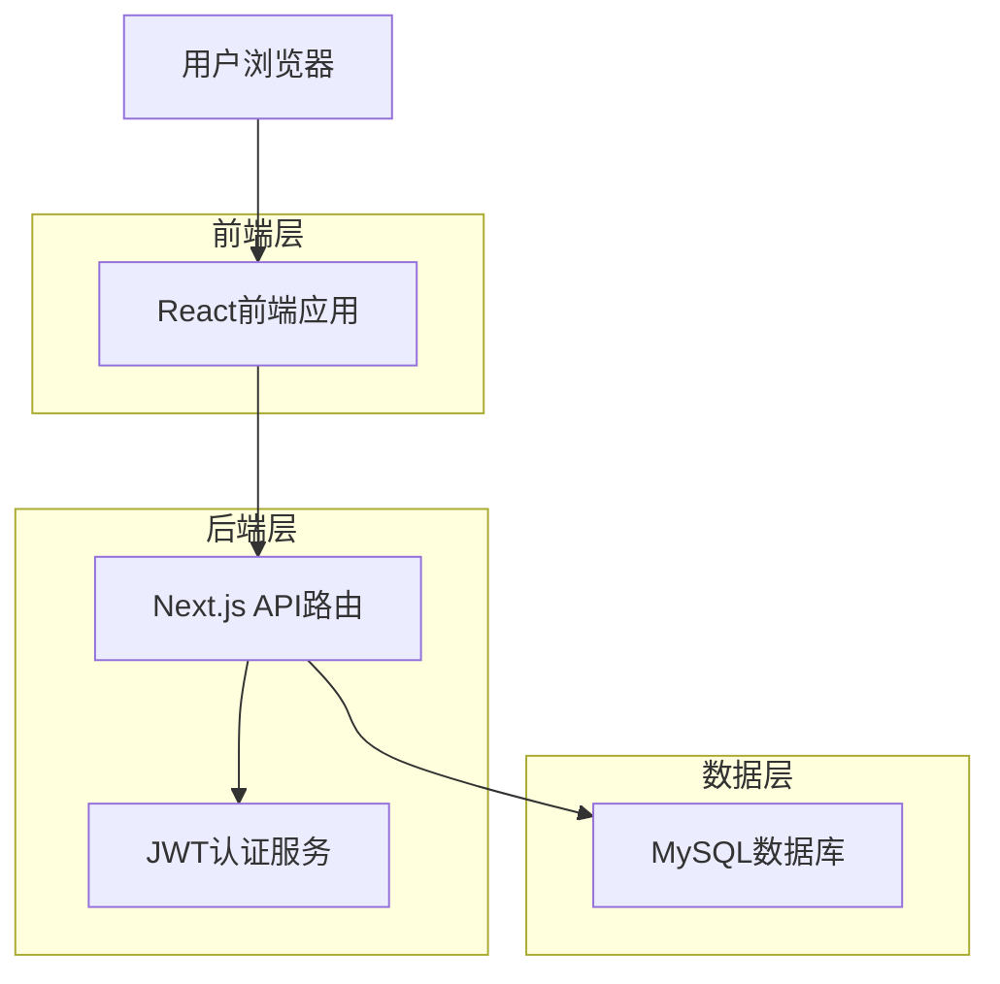
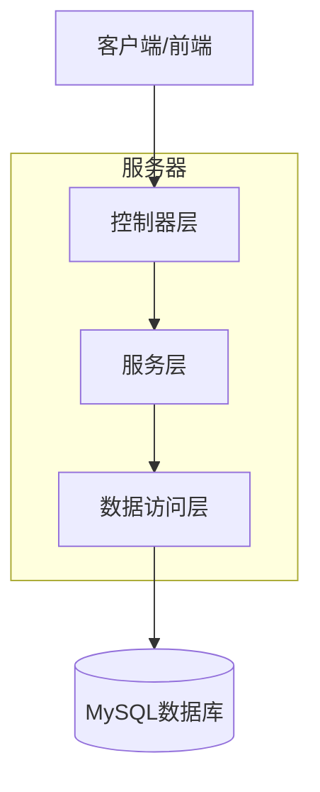
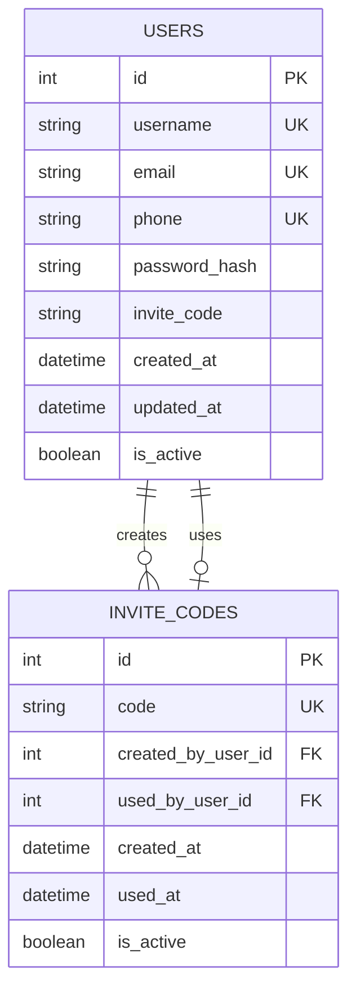

# Ai企业获客盈利系统 - 用户注册登录系统技术架构文档

## 1. 架构设计



## 2. 技术描述

- 前端：React@18 + Next.js@14 + TypeScript + Tailwind CSS
- 后端：Next.js API Routes + bcryptjs + jsonwebtoken
- 数据库：MySQL (提供的远程数据库)
- 认证：JWT Token + HTTP-only Cookies

## 3. 路由定义

| 路由 | 用途 |
|------|------|
| /auth/login | 用户登录页面 |
| /auth/register | 用户注册页面 |
| /auth/logout | 登出处理 |
| / | 主页（需要登录） |
| /admin | 后台管理页面（需要登录） |

## 4. API定义

### 4.1 核心API

#### 用户注册
```
POST /api/auth/register
```

请求参数：
| 参数名 | 参数类型 | 是否必填 | 描述 |
|--------|----------|----------|------|
| username | string | true | 用户名，3-20字符 |
| email | string | true | 邮箱地址 |
| phone | string | true | 手机号码 |
| password | string | true | 密码，6-20字符 |
| inviteCode | string | false | 邀请码（可选） |

响应参数：
| 参数名 | 参数类型 | 描述 |
|--------|----------|------|
| success | boolean | 注册是否成功 |
| message | string | 响应消息 |
| userId | number | 用户ID（成功时返回） |

请求示例：
```json
{
  "username": "testuser",
  "email": "test@example.com",
  "phone": "13800138000",
  "password": "123456",
  "inviteCode": "ABC123"
}
```

#### 用户登录
```
POST /api/auth/login
```

请求参数：
| 参数名 | 参数类型 | 是否必填 | 描述 |
|--------|----------|----------|------|
| identifier | string | true | 用户名/邮箱/手机号 |
| password | string | true | 密码 |
| remember | boolean | false | 是否记住登录 |

响应参数：
| 参数名 | 参数类型 | 描述 |
|--------|----------|------|
| success | boolean | 登录是否成功 |
| message | string | 响应消息 |
| token | string | JWT令牌（成功时返回） |
| user | object | 用户信息（成功时返回） |

#### 验证登录状态
```
GET /api/auth/verify
```

响应参数：
| 参数名 | 参数类型 | 描述 |
|--------|----------|------|
| success | boolean | 验证是否成功 |
| user | object | 用户信息（验证成功时返回） |

#### 用户登出
```
POST /api/auth/logout
```

响应参数：
| 参数名 | 参数类型 | 描述 |
|--------|----------|------|
| success | boolean | 登出是否成功 |
| message | string | 响应消息 |

## 5. 服务器架构图



## 6. 数据模型

### 6.1 数据模型定义



### 6.2 数据定义语言

#### 用户表 (users)
```sql
-- 创建用户表
CREATE TABLE users (
    id INT AUTO_INCREMENT PRIMARY KEY,
    username VARCHAR(50) UNIQUE NOT NULL COMMENT '用户名',
    email VARCHAR(100) UNIQUE NOT NULL COMMENT '邮箱地址',
    phone VARCHAR(20) UNIQUE NOT NULL COMMENT '手机号码',
    password_hash VARCHAR(255) NOT NULL COMMENT '密码哈希',
    invite_code VARCHAR(20) DEFAULT NULL COMMENT '使用的邀请码',
    created_at TIMESTAMP DEFAULT CURRENT_TIMESTAMP COMMENT '创建时间',
    updated_at TIMESTAMP DEFAULT CURRENT_TIMESTAMP ON UPDATE CURRENT_TIMESTAMP COMMENT '更新时间',
    is_active BOOLEAN DEFAULT TRUE COMMENT '账户是否激活'
) ENGINE=InnoDB DEFAULT CHARSET=utf8mb4 COLLATE=utf8mb4_unicode_ci COMMENT='用户表';

-- 创建索引
CREATE INDEX idx_users_username ON users(username);
CREATE INDEX idx_users_email ON users(email);
CREATE INDEX idx_users_phone ON users(phone);
CREATE INDEX idx_users_created_at ON users(created_at DESC);

-- 邀请码表（可选功能）
CREATE TABLE invite_codes (
    id INT AUTO_INCREMENT PRIMARY KEY,
    code VARCHAR(20) UNIQUE NOT NULL COMMENT '邀请码',
    created_by_user_id INT DEFAULT NULL COMMENT '创建者用户ID',
    used_by_user_id INT DEFAULT NULL COMMENT '使用者用户ID',
    created_at TIMESTAMP DEFAULT CURRENT_TIMESTAMP COMMENT '创建时间',
    used_at TIMESTAMP NULL DEFAULT NULL COMMENT '使用时间',
    is_active BOOLEAN DEFAULT TRUE COMMENT '是否有效'
) ENGINE=InnoDB DEFAULT CHARSET=utf8mb4 COLLATE=utf8mb4_unicode_ci COMMENT='邀请码表';

-- 创建外键约束
ALTER TABLE invite_codes 
ADD CONSTRAINT fk_invite_codes_created_by 
FOREIGN KEY (created_by_user_id) REFERENCES users(id) ON DELETE SET NULL;

ALTER TABLE invite_codes 
ADD CONSTRAINT fk_invite_codes_used_by 
FOREIGN KEY (used_by_user_id) REFERENCES users(id) ON DELETE SET NULL;

-- 初始化数据（固定邀请码）
INSERT INTO invite_codes (code, is_active) VALUES 
('1212', TRUE),
('7777', TRUE);
```

## 7. 前端组件架构

### 7.1 组件层次结构

```
src/
├── components/
│   ├── auth/
│   │   ├── LoginForm.tsx          # 登录表单组件
│   │   ├── RegisterForm.tsx       # 注册表单组件
│   │   ├── AuthLayout.tsx         # 认证页面布局
│   │   └── ProtectedRoute.tsx     # 路由保护组件
│   └── ui/
│       ├── Input.tsx              # 输入框组件
│       ├── Button.tsx             # 按钮组件
│       └── Card.tsx               # 卡片组件
├── hooks/
│   ├── useAuth.ts                 # 认证状态管理
│   └── useForm.ts                 # 表单处理
├── utils/
│   ├── auth.ts                    # 认证工具函数
│   ├── validation.ts              # 表单验证
│   └── api.ts                     # API请求封装
└── types/
    └── auth.ts                    # 认证相关类型定义
```

### 7.2 核心组件设计

#### AuthLayout组件
- 提供统一的认证页面布局
- 包含立体卡片效果和响应式设计
- 支持背景渐变和动画效果

#### LoginForm组件
- 智能识别登录方式（用户名/邮箱/手机号）
- 表单验证和错误提示
- 记住登录状态功能

#### RegisterForm组件
- 多字段注册表单
- 实时验证和重复检查
- 邀请码可选填写

#### ProtectedRoute组件
- 路由级别的登录保护
- 自动重定向到登录页
- 登录后返回原页面

### 7.3 状态管理

使用React Context + useReducer实现全局认证状态管理：

```typescript
interface AuthState {
  user: User | null;
  isLoading: boolean;
  isAuthenticated: boolean;
  token: string | null;
}

interface AuthContextType {
  state: AuthState;
  login: (credentials: LoginCredentials) => Promise<void>;
  register: (userData: RegisterData) => Promise<void>;
  logout: () => void;
  checkAuth: () => Promise<void>;
}
```

## 8. 安全考虑

### 8.1 密码安全
- 使用bcryptjs进行密码哈希
- 密码强度要求：至少6位，包含字母和数字
- 防止密码明文传输和存储

### 8.2 认证安全
- JWT token有效期设置（24小时）
- HTTP-only cookies存储token
- CSRF保护和XSS防护

### 8.3 输入验证
- 前后端双重验证
- SQL注入防护
- 输入长度和格式限制

### 8.4 账户安全
- 登录失败次数限制
- 账户锁定机制
- 邮箱和手机号唯一性检查